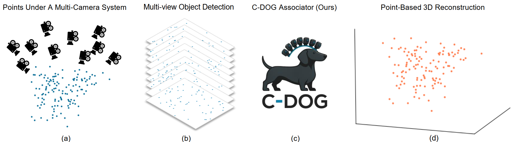

# C-DOG_Multi-View_Multi-Object_Association
A lightweight multi-view multi-object association tool. It bridges the 2D detection and 3D reconstruction using only camera pose and 2D pixel coordinates. Plug in to your work and be ready to play.

[paper](https://arxiv.org/abs/2507.14095)

> **Note:** The author graduated and enjoyed a memorable road trip from Wisconsin to California.  
> The wildlife in Rocky Mountain National Park was truly spectacular. 🦌🏞

# Usage

# 📦 Data Preparation

1.Unzip datasets
Unzip `benchmarks.zip` and `data.zip` into the same directory.

2.Folder contents
- `benchmark/`
Contains a sample test case with 130 object instances, represented as points.

- `data/`
Contains camera pose data:

  - K – 3×3 intrinsic matrix

  - R – 3×3 rotation matrix

  - T – 1×3 translation vector

  - Default setup: 10 cameras, total 10 sets of K, R, T (adjustable).

  - Calibrated using [OpenMVG](https://github.com/openMVG/openMVG) in the [EasyVis pipeline](https://github.com/Yunghong/EasyVis).

3. Custom camera data
Replace with your own 'K', 'R', 'T' files in the same format to run C-DOG on your dataset.

# 🚀 Usage
Run the main script:
<pre>python main.py  </pre>

The script outputs the associated 2D point groups, where each group contains 10 2D points (one per camera). Each group represents the observations of the same 3D points from different views (built correspondences). The invalid 2D points are marked as [-1, -1].

C-DOG relies on common Python packages, making setup and execution straightforward.

# 📜 Citation
If you use this work in your research, please cite:
<pre>@article{sun2025c,
  title={C-DOG: Multi-View Multi-instance Feature Association Using Connected δ-Overlap Graphs},
  author={Sun, Yung-Hong and Lin, Ting-Hung and Chen, Jiangang and Jiang, Hongrui and Hu, Yu Hen},
  journal={arXiv preprint arXiv:2507.14095},
  year={2025}
}  </pre>
